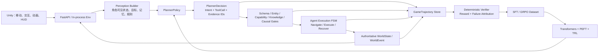

# NovelSim 大厂游戏 AI 项目优化 Plan

> 版本：V2.1（执行版）
> 更新日期：2026-08-01
> 目标岗位：大厂游戏 AI / 游戏 Agent / LLM Agent / 智能 NPC 算法实习与校招
> 当前决策：V1 求职版保持冻结；V2 Phase 1 已完成，Phase 2 的正式确定性专家数据已达到规模、恢复与泄漏门槛；下一步完成有限 PromptedLLM 数据源验证并进入 0.6B SFT pipeline smoke。
> Git 基线：`main` / `8f36928`，已与 `origin/main` 同步。
> V2 开发分支：`codex/trainable-planner-v2`；正式数据采集代码基线：`f6f9f20`。

---

## 0. 结论先行

NovelSim 下一阶段不应继续横向增加后台、编辑器、剧情数量或通用平台能力，而应完成一条此前项目中尚未闭合、同时又最能复用个人经历的技术链：

```text
Unity / Python 权威游戏世界
→ 结构化高层 NPC 决策
→ 确定性 Tool / Rule / Causal Gate
→ GameTrajectory 采集与失败归因
→ SFT / GRPO 后训练
→ 未见世界泛化评测
→ Unity 实时演示与公开作品集
```

项目的新定位统一为：

> **NovelSim：面向 Unity 游戏运行时的可训练、可约束、可评测多智能体 NPC 决策系统。**

唯一核心研究问题是：

> 在保持同一套服务端权威规则和工具门禁的前提下，经过 SFT/GRPO 后训练的高层 NPC Planner，能否比 Scripted、Direct Prompt 和 ReAct 基线在未见世界上取得更高的任务完成率、角色一致性和行动效率，同时保持非法世界状态提交为 0？

这比“做一个 LLM 生成小说/模拟小说世界”更贴近大厂游戏 AI 岗位，因为它同时展示：

1. 游戏运行时中的分层 Agent 架构；
2. 工具调用、行为执行与实时性约束；
3. 轨迹数据构建、SFT、强化学习和严格 holdout；
4. 多 NPC 认知隔离、信息传播和角色行为；
5. Unity 可玩交付、工程测试和量化评测。

### 0.1 当前执行快照

| 模块 | 状态 | 已有证据 / 下一验收 |
|---|---|---|
| V1 求职版 | **100% 已完成并冻结** | Python `333 passed, 15 deselected`；Unity EditMode `6/6`、PlayMode `7/7`；Windows 三路线 smoke 通过 |
| V1 客观评测 | **已完成** | 确定性场景 `9/9`；真实 LLM `20/20` 完成运行、目标成功 `18/20 = 90%`；已提交事件的回放、因果证据、叙事覆盖与结构化依据均为 `100%` |
| V1 主观校准 | **已完成，小样本不外推** | 强基线 Pairwise `3:3`；真人/Judge 一致 `5/6 = 83.33%`，Cohen's κ `0.667` |
| V1 作品集 | **已完成** | README、架构图、Windows 包、世界包、演示脚本和 `138.50s` Unity 核心视频齐备 |
| V2 方案设计 | **100% 已完成** | 架构、数据、SFT/GRPO、OOD 评测、4090 算力路线与交付门槛已确定 |
| V2 代码实施 | **Phase 1 完成，Phase 2 接近完成** | 720 个场景采集 Scripted / Safe Heuristic / Controlled Recovery 共 `2,160 episode / 9,120 step`；PromptedLLM 来源、SFT 脚本和 checkpoint 尚未完成 |
| 当前唯一主线 | **Prompted 数据 smoke → Phase 3** | 只在 Train/Dev 小样本运行真实 PromptedLLM，记录模型/Token/fallback/verifier；不打开 Test-ID/Test-OOD，然后构建 SFT train/dev 数据 |

进度口径：V1 与 V2 分开报告。不能把 V1 已完成的工程闭环计入 V2 的训练完成度，也不能在正式 OOD 报告生成前写“训练带来提升”。

---

## 1. 当前基线与真正缺口

### 1.1 已经完成、应直接冻结的 V1 能力

| 能力 | 当前证据 | V2 决策 |
|---|---|---|
| 权威世界状态 | FastAPI、SQLite、原子事件提交、存档恢复 | 直接复用 |
| 受控工具执行 | ToolRegistry、Agent FSM、超时、重试、重规划 | 直接复用 |
| 世界规则约束 | Schema、实体、能力、Affordance、知识和因果门禁 | 直接复用 |
| 多 NPC 认知 | beliefs、记忆、信息传播、联盟、反思 | 直接复用 |
| 可玩客户端 | Unity 6.3、NavMesh、交互、HUD、三路线 Windows smoke | 冻结为 V1 Demo |
| 自动评测 | 确定性 benchmark、真实 LLM、Pairwise、消融、Trace | 扩展而非重写 |
| 工程质量 | Python `333 passed, 15 deselected`；Unity EditMode `6/6`、PlayMode `7/7` | 作为回归基线 |
| 主观评测边界 | 6 题真人/Judge 一致 `5/6`，Cohen's κ `0.667`，样本小不外推 | V2 扩大样本并继续谨慎表述 |

### 1.2 当前最影响竞争力的五个缺口

1. **没有可训练的 Planner 主线。**
   当前存在 Prompt/LLM 决策和确定性执行，但没有统一的 `PlannerPolicy` 接口、训练数据导出器、SFT/GRPO checkpoint 和策略对比。

2. **评测集规模不足以证明泛化。**
   当前 9 条确定性 case、20 条真实 LLM case 和 6 条 Pairwise 样本能够证明闭环可运行，但不能证明模型学会了跨世界规划。

3. **单一剧情容易被理解为 Demo 特判。**
   “密信”竖切片很适合演示，但需要参数化世界族和未见 `scenario_family` 才能排除记忆答案、Prompt 特化和规则硬编码。

4. **尚未把个人后训练经历落到游戏运行时。**
   简历中已经有 SFT、GRPO、OPD-lite、trajectory rollout 和 failure attribution；NovelSim 仍缺一条把这些经历统一起来的可公开证据链。

5. **Planner 质量与 Runtime 安全尚未分开报告。**
   “模型提出非法动作”和“非法动作真的写入世界”是两个指标。V2 必须同时证明模型越来越少提出非法动作，以及门禁始终保证非法提交为 0。

---

## 2. 五份经历如何复用

### 2.1 复用矩阵

| 参考资产 | 可复用的方法 | NovelSim 中的具体落点 | 不直接照搬的部分 |
|---|---|---|---|
| Agent-One 实习 | 轨迹重建、确定性失败归因、EvidencePack、最小可行动修复上下文、性能预算 | `GameTrajectory`、`FailureAttribution`、错误切片、训练样本过滤、Planner 失败报告 | 不复制公司代码、真实 trace、Prompt、客户数据和内部指标 |
| SocioPlan | 结构化决策作为可控优化接口、BC→RL、event-level split、rollout-level 指标、reward ablation | 将自由文本决策改为结构化 `PlannerDecision`；先 SFT，再 GRPO；按世界族划分 | 不复用简单 Hash-Embedding Planner；KL/DTW 不作为游戏任务的唯一主指标 |
| TiG Dota | Qwen LoRA、SFT→GRPO、严格 holdout、数据哈希、random control、负结果诚实报告 | Qwen3 小模型 LoRA；训练/测试世界哈希审计；SFT/GRPO/随机纠错消融 | OPD-lite 暂不进入主线，只有 SFT+GRPO 已稳定后再做 P2 |
| KDD DataAgent | ReAct JSON Action、ToolRegistry、阶段化执行、只读/超时/验证/提交门禁 | 统一 Policy 输出和 Tool Schema；Planner/Runtime/Verifier 分层；超时 fallback | 不引入与游戏无关的数据分析工具和复杂通用 Agent 平台 |
| SPARK | Persona、短期/长期双记忆、Agent—环境双向演化、记忆消融、微观案例与宏观指标 | 角色画像条件化、短/长记忆对比、belief/relationship/plot-thread 联动分析 | 不允许 LLM 通过“新话题”创建新世界事实、科技、物品或能力 |

### 2.2 Clean-room 与公开发布边界

以下规则是硬约束：

- Agent-One 只复用通用设计思想和本人可公开描述的经验，不复制实习仓库代码、真实轨迹、客户数据、内部 Prompt 和未公开接口；
- SocioPlan、TiG、KDD、SPARK 中的数据不能混入 NovelSim 训练集；
- NovelSim 训练数据只来自原创/明确授权世界、公开模型生成和确定性引擎；
- 所有样本保存 `source_type`、`world_package_id`、`scenario_family`、`content_hash` 和 `generator_version`；
- 发布前执行 secret scan、license audit、数据卡和模型卡检查。

---

## 3. V2 的技术假设

### H1：结构化 Planner 可训练

将高层决策限制为结构化 `PlannerDecision + ToolCall` 后，SFT 应比 Direct Prompt 提高：

- Tool Schema 合法率；
- 合法动作提议率；
- 目标完成率；
- 证据使用准确率；
- 重规划恢复率。

### H2：结果奖励优于单一动作模仿

游戏中经常存在多条合理路线，因此不能把“和唯一标准动作一样”当作主要正确性定义。GRPO 应围绕以下结果学习：

- 是否完成目标；
- 是否满足世界规则和知识边界；
- 是否保持角色目标与人格；
- 是否形成有效因果链；
- 是否减少无效循环和冗余动作。

动作 Exact Match 只作为诊断指标，不作为最终结论。

### H3：安全门禁与模型能力可独立测量

- `illegal_proposal_rate` 衡量 Planner 是否理解世界；
- `illegal_commit_count` 衡量 Runtime 是否守住权威状态；
- 完整系统的 `illegal_commit_count` 必须始终为 0；
- 训练的目标之一是降低非法提议，而不是通过关闭门禁让模型获得奖励。

### H4：双记忆应改善长期行为，而不是只增加文本

SPARK 的启发在 NovelSim 中应通过消融验证：

- 无记忆；
- 只有短期记忆；
- 短期 + 长期记忆；
- 短期 + 长期 + reflection。

主要观察角色一致性、知识泄漏、信息传播、目标保持和无效循环，而不是只展示更长的对话。

---

## 4. 目标架构



### 4.1 分层更新频率

| 层 | 运行频率 | 技术 |
|---|---:|---|
| 角色移动、寻路、动画 | 每帧/物理 Tick | Unity、NavMesh、FSM |
| 工具前置条件与状态提交 | 每次 Action | Python 确定性规则 |
| 高层决策 | 事件触发或 1–3 秒一次 | 本地 Planner 模型 |
| 长期记忆与反思 | 关键事件/回合结束 | 异步 Worker |
| 训练 rollout | 离线高速批量 | In-process Python Env |

LLM 不控制逐帧移动、碰撞、动画和底层战斗。它只选择高层意图与工具；超时后立即使用确定性 fallback。

### 4.2 必须新增的接口

```python
class PlannerPolicy(Protocol):
    policy_id: str

    def decide(
        self,
        observation: "GameObservation",
        available_tools: list["ToolDefinition"],
    ) -> "PlannerDecision": ...
```

首批实现：

1. `ScriptedPolicy`：确定性专家与回归基线；
2. `PromptedLLMPolicy`：当前零样本/少样本基线；
3. `ReActPolicy`：允许一次观察—行动—结果—重规划；
4. `SFTPolicy`：LoRA 监督微调模型；
5. `GRPOPolicy`：在 SFT checkpoint 上继续进行环境奖励训练。

### 4.3 `PlannerDecision` 最小 Schema

```json
{
  "decision_id": "uuid",
  "intent": "investigate|share|protect|negotiate|deceive|ally|move|wait",
  "goal_id": "goal_x",
  "tool_call": {
    "tool_name": "share_information",
    "arguments": {}
  },
  "evidence_ids": ["fact_12", "memory_7"],
  "predicted_preconditions": ["target_is_nearby"],
  "predicted_effects": ["target_receives_fact_12"],
  "fallback_intent": "observe",
  "confidence": 0.78
}
```

约束：

- `predicted_effects` 只用于 Verifier 检查，绝不是状态变更指令；
- 只有 ToolRegistry 生成并通过验证的 `StatePatch` 才能改变世界；
- `wait/observe` 是合法动作，避免模型被迫每轮制造事件；
- 不保存或蒸馏隐藏思维链，只保存短理由、证据 ID、ToolCall 和结果；
- 同一个共享 Planner 通过 persona、goal、belief 和 memory 条件化不同 NPC，不为每个 NPC 训练一套模型。

### 4.4 “夜轻歌开飞机飞走”类输入如何处理

V2 继续坚持：

```text
文本中出现“开飞机”
→ Intent Parser 可理解为候选意图
→ World Concept Gate 检查当前世界是否注册 aircraft
→ Entity / Capability / Affordance 检查飞机、驾驶能力和可用交互
→ 任一条件不满足：返回 WORLD_CONCEPT_UNAVAILABLE / ENTITY_NOT_FOUND / CAPABILITY_MISSING
→ WorldState 不变
→ Narrative 只能描述尝试失败，不能写成已经飞走
```

SPARK 中“新话题自然涌现”的机制只能映射成非权威的 `discussion_thread` 或 NPC 关注点，不能自动注册新实体、新科技、新魔法和新事实。

---

## 5. 训练数据方案

### 5.1 `GameTrajectory` 统一格式

每个决策步至少保存：

```text
run_id / episode_id / step_id
world_package_id / scenario_family / variant_id / seed
policy_id / model_id / prompt_version / code_commit
authoritative_state_hash
perceived_observation
persona / active_goals / retrieved_memory_ids
available_tools
planner_decision
schema_validation
world_gate_result
tool_result
committed_event_ids
next_state_hash
reward_breakdown
failure_labels
episode_ending
token_usage / latency
```

存储：

- 逐步审计：JSONL；
- 批量训练/分析：Parquet；
- 快速切片：DuckDB；
- Schema：保持与当前 Pydantic 版本兼容，不为“追新”强制升级整个运行时。

### 5.2 数据来源

| 数据源 | 作用 | 是否进入 SFT |
|---|---|---|
| Scripted expert | 高质量确定性正样本 | 是 |
| Safe heuristic / Utility policy | 多路线正样本和中等质量样本 | 通过过滤后进入 |
| Prompted strong model | 增加语言和策略多样性 | 通过 verifier 后进入 |
| 当前/弱模型 rollout | GRPO 起点、失败切片 | 不直接作为正样本 |
| Adversarial invalid probes | 世界概念、实体、知识、因果负样本 | 用于拒绝/分类训练与评测 |
| 真人演示 | 少量关键场景校准 | 可选，单独标记 |

### 5.3 不使用唯一“标准答案”

针对多解问题：

- 一个初始状态允许保存多条成功轨迹；
- 训练样本标记 `accepted_outcomes` 和 `constraint_set`；
- SFT 学习多个可接受策略，不把某一条路线包装成唯一正确答案；
- 主评测使用任务完成、累计回报、规则满足和角色约束；
- Action Accuracy、轨迹 KL/DTW 仅用于分析策略分布，不作为“谁绝对正确”的结论。

### 5.4 数据规模分两档

#### MVP 档

- 3 个 `scenario_family`；
- 每族至少 10 个参数化变体；
- 每变体至少 5 个 seed；
- 至少 200 个完整 episode；
- 至少 5,000 个有效决策步；
- 至少 20% 为受控失败/恢复轨迹。

#### 对外主结果档

- 5 个 `scenario_family`；
- 至少 1,000 个完整 episode；
- 20,000–50,000 个有效决策步；
- 训练、开发、测试按世界族划分，不按单步随机划分；
- 测试中至少包含一个训练时完全未见的世界族和两组未见规则组合。

建议世界族：

1. `secret_transport`：密信、证据转移与拦截；
2. `resource_negotiation`：稀缺物品、交易、说服和欺骗；
3. `rescue_escort`：时限、救援、护送和路径约束；
4. `identity_suspicion`：身份线索、认知隔离和错误指认；
5. `alliance_conflict`：结盟、背叛、共同目标和关系演化。

前两周只实现前三族；后两族属于主结果扩展，不能阻塞最小训练闭环。

### 5.5 严格划分与泄漏审计

```text
Train：可见世界族 + 可见参数组合
Dev：可见机制的新组合，用于 reward / checkpoint 选择
Test-ID：相同世界族但未见变体
Test-OOD：完全未见 scenario_family 或未见规则组合
Adversarial：不可能动作、知识越界和因果欺骗
```

每次训练前生成：

- `split_manifest.json`；
- `content_hashes.jsonl`；
- world/entity/rule overlap 报告；
- Prompt、few-shot、世界文本与测试集的 n-gram/hash 审计；
- checkpoint 选择只能使用 Dev，Test-OOD 只在冻结后运行。

---

## 6. 主流训练与推理栈

### 6.1 选型

| 模块 | 主选技术 | 原因 |
|---|---|---|
| 基础模型 | Qwen3-0.6B（smoke）/ Qwen3-4B-Instruct-2507（主实验） | 中文、Agent/tool 能力、开源、资源可控 |
| 监督微调 | Transformers + TRL `SFTTrainer` | 主流、可复现、与后续 RL 同栈 |
| 参数高效训练 | PEFT LoRA/QLoRA | 降低显存和 checkpoint 成本 |
| 在线强化学习 | TRL `GRPOTrainer` | 支持自定义奖励、工具和有状态环境 |
| Rollout/推理 | vLLM OpenAI-compatible server | 高吞吐、结构化输出、严格 Tool Schema |
| 数据 | JSONL + Parquet + DuckDB | 审计、训练和切片兼顾 |
| 实验记录 | 本地 JSON/Markdown + TensorBoard；W&B 可选 | 可复现优先，不强绑定外部服务 |

官方依据：

- TRL 当前支持工具调用和带 `reset/get_reward` 的有状态训练环境：<https://huggingface.co/docs/trl/en/grpo_trainer>
- PEFT 将 LoRA 作为主流的参数高效微调起点：<https://huggingface.co/docs/peft/main/package_reference/lora>
- vLLM 支持基于 JSON Schema 的严格 Tool Calling：<https://docs.vllm.ai/en/latest/features/tool_calling/>
- Qwen3 官方提供 0.6B、1.7B、4B、8B 等开源尺寸并强调 Agent 能力：<https://qwenlm.github.io/blog/qwen3/>

### 6.2 为什么不直接训练 14B

- 该项目要证明的是训练闭环和游戏环境设计，不是参数量；
- 0.6B 先验证数据/奖励/环境，4B 再形成主结果；
- 只有 4B 的 OOD 结果、reward 曲线和 rollout 稳定后，才考虑 8B；
- 14B 不作为 V2 的完成条件，避免算力成为项目交付瓶颈。

### 6.3 `NovelSimEnv` 的训练形态

训练不启动 Unity：

```python
class NovelSimEnv:
    def reset(self, scenario_key, seed) -> str:
        # 加载 WorldPackage，生成同组一致初始状态
        ...

    def step(self, planner_decision) -> ToolResult:
        # 调用现有 ToolRegistry / Rule / Patch / Event
        ...

    def get_reward(self) -> float:
        # 由权威状态和 verifier 计算
        ...
```

关键要求：

- GRPO 同一 group 的多个采样必须从完全相同的 `world_package_id + seed + state_hash` 开始；
- 引擎以 in-memory store 运行，避免 SQLite/FastAPI 成为 rollout 瓶颈；
- 环境行为与线上 Runtime 共享 Tool/Rule/Patch 核心代码；
- Unity 只消费冻结策略产生的权威事件；
- 训练和线上均保留 3 秒硬超时与确定性 fallback。

---

## 7. Reward 与 Failure Attribution

### 7.1 Reward 初始组成

```text
R =
  0.35 * objective_progress
+ 0.15 * tool_execution
+ 0.15 * causal_grounding
+ 0.10 * character_consistency
+ 0.10 * information_integrity
+ 0.05 * recovery_quality
+ 0.05 * action_efficiency
+ 0.05 * terminal_outcome
- penalties
```

初始惩罚：

- 非法 Schema；
- 不存在实体/概念；
- 缺失能力或 Affordance；
- 知识边界越权；
- 重复循环；
- 与主动目标无关的随机行为；
- 声称未提交效果已经发生；
- 超出最大步数或超时。

权重只作为第一版，必须通过 Dev 上的 ablation 和 reward hacking 检查决定，不得根据 Test-OOD 调参。

### 7.2 硬约束与软奖励的边界

| 条件 | Runtime 行为 | Reward |
|---|---|---|
| Schema 非法 | 拒绝 | 负 |
| 世界不存在飞机/魔法 | 拒绝 | 负 |
| 角色无能力/知识 | 拒绝 | 负 |
| Tool 合法但没有推进目标 | 可执行 | 小负或 0 |
| Tool 合法且推进目标 | 执行 | 正 |
| 失败后正确观察并重规划 | 执行 | 正 |
| 非法 Patch | 永不提交 | 强负，`illegal_commit_count` 仍为 0 |

### 7.3 游戏版 Failure Taxonomy

复用 Agent-One 的“确定性证据优先”思想，建立：

```text
Environment Contract
  invalid_schema
  unknown_entity
  unavailable_world_concept
  missing_capability
  missing_affordance

Action Realization
  navigation_failed
  tool_precondition_failed
  tool_timeout
  patch_rejected
  version_conflict

Trajectory Regulation
  repeated_loop
  no_progress
  retry_exhausted
  premature_termination
  objective_abandonment

Cognitive Integrity
  knowledge_leak
  unsupported_belief
  evidence_mismatch
  persona_goal_conflict
```

每个失败样本必须能追溯到：

- 权威状态；
- Planner 输出；
- Gate/Tool 结果；
- 失败标签；
- 可重放 seed；
- 对应回归测试。

---

## 8. 实验矩阵

### 8.1 Planner 主对比

| ID | 策略 | 训练 | 记忆 | 门禁 | 回答的问题 |
|---|---|---|---|---|---|
| B0 | Scripted/Utility | 无 | 结构化 | Full | 确定性专家上界/工程基线 |
| B1 | Direct Prompt | 无 | 摘要 | Full | 自由文本/一次生成能做到什么 |
| B2 | ReAct Tool Agent | 无 | 短+长 | Full | 多步工具反馈的增益 |
| M1 | SFT Planner | LoRA SFT | 短+长 | Full | 结构化模仿学习是否有效 |
| M2 | SFT + GRPO | LoRA SFT+RL | 短+长 | Full | 环境结果奖励是否进一步有效 |

所有主对比共享：

- 相同基础模型；
- 相同世界状态与可见信息；
- 相同 Tool Schema；
- 相同 Runtime Gate；
- 相同 seed、最大步数和超时；
- 相同 Test-ID / Test-OOD。

### 8.2 必做消融

| 消融 | 目的 |
|---|---|
| M2 w/o long-term memory | 验证 SPARK 式双记忆是否真实有效 |
| M2 w/o reflection | 判断反思是否改善长期行为还是只增加 Token |
| M2 w/o failure feedback | 验证结构化工具结果/失败码的作用 |
| M2 reward: objective only | 检查混合 reward 是否优于单一目标奖励 |
| M2 reward: no character term | 检查角色一致性 reward |
| M2 reward: no efficiency term | 检查是否出现循环或拖延 |
| Random accepted trajectory control | 排除收益仅来自更多训练步数 |

### 8.3 Runtime 安全消融

现有 G0–G3 Gate 消融继续保留，但与 Planner 对比分表报告：

- Planner 表回答“模型是否更会决策”；
- Gate 表回答“系统是否能阻止模型破坏世界”；
- 不能用关闭 Gate 的实验替代模型能力实验。

---

## 9. 评测协议

### 9.1 客观主指标

| 维度 | 指标 |
|---|---|
| 任务 | objective completion、normalized return、结局分布 |
| Planner | Tool Schema 合法率、合法提议率、正确证据引用率 |
| 执行 | Tool success、replan recovery、unexpected rejection |
| 安全 | illegal proposal、illegal commit、causal violation、unknown entity accept |
| 长轨迹 | turns-to-success、no-progress step、invalid loop、premature termination |
| 认知 | knowledge leak、belief grounding、evidence-chain completeness |
| 多 Agent | propagation accuracy、alliance outcome、角色目标保持 |
| 泛化 | Test-ID、Test-OOD、未见规则组合差值 |
| 工程 | P50/P95 latency、Token、GPU memory、timeout、fallback success |

### 9.2 次要分布指标

借鉴 SocioPlan，但谨慎解释：

- Action/Intent 分布 KL 或 JS；
- 成功轨迹长度 Wasserstein；
- 目标进度曲线 DTW；
- 失败类型分布。

这些指标只能说明策略分布和时序差异，不能说明与唯一“标准轨迹”越接近就越正确。

### 9.3 主观评测

只评估难以完全结构化的维度：

- 角色忠实度；
- 计划连贯性；
- 叙事因果可理解性；
- 游戏趣味性；
- 行为是否显得有目的而非随机。

协议：

- 至少 30 个独立初始状态；
- 每个状态比较 M2 与最强基线；
- 至少 3 位盲评者；
- 随机交换左右顺序；
- 单独记录 Tie；
- 报告胜/负/平、Bootstrap 95% CI 和 Krippendorff's α 或 Fleiss' κ；
- 若置信区间不能排除 50%，只报告趋势，不写“显著领先”。

### 9.4 V2 完成门槛

硬门槛：

- Python、Unity V1 回归全部保持通过；
- 完整系统 `illegal_commit_count = 0`；
- Test-OOD 至少 100 个 episode；
- 每个主方法使用完全相同的测试 manifest；
- fallback 在模型超时/格式失败时成功率 100%；
- 训练、开发、测试无 world/variant hash 泄漏。

效果门槛：

- SFT 相对 PromptedLLM 在 Test-OOD 的目标完成率提升至少 8 个百分点，或在完成率不降的情况下减少至少 20% 无效步骤；
- GRPO 相对 SFT 再提升至少 5 个百分点，或在完成率不降的情况下减少至少 15% 平均完成步数；
- SFT/GRPO 的非法提议率均低于未训练基线；
- 人类偏好只有在样本和置信区间达标后才形成领先结论。

如果没有达到效果门槛，V2 仍可作为负结果交付，但简历只写完成了训练与严格评测，不写“显著提升”。

---

## 10. 分阶段实施

### Phase 0：冻结 V1 与建立边界（2 天）

> 状态：**已完成（2026-08-01 复核）**。V1 已合并并推送到 `main@8f36928`，工作树与远端一致。

任务：

- 保留现有 `GameAI_LLM_Agent求职版计划.md` 为完成态；
- 记录 V1 代码、世界包、视频、评测报告和 hash；
- 建立 V2 数据/模型 license 与 clean-room 清单；
- 不再修改 V1 Demo 的核心剧情和视觉表现，除非出现回归缺陷。

验收：

- V1 所有测试、Unity build、三路线 smoke 可复现；
- V2 改动不会污染已完成的作品集证据。

### Phase 1：Policy 与 Trajectory 合同（3–4 天）

> 状态：**已完成（2026-08-01）**。Phase 1A/1B 均完成；本阶段未运行 SFT/GRPO。

建议新增：

```text
engine/planner_policy.py
engine/game_observation.py
engine/planner_decision.py
engine/game_trajectory.py
training/export_trajectories.py
training/schemas.py
tests/unit/test_planner_policy.py
tests/unit/test_game_trajectory.py
```

#### Phase 1A：统一 Planner 合同（优先）

> 状态：**已完成（2026-08-01）**。新增 14 项测试，三种 Policy 在相同密信场景中共享同一 SceneController、ToolRegistry、FSM 与 Gate；加入错误/超时 scripted fallback，并验证非法 aircraft 目标不会提交事件或改变状态。全量 Python 回归为 `347 passed, 15 deselected`。

任务：

- 定义不可直接修改世界的 `GameObservation` 只读输入；
- 定义结构化 `PlannerDecision`，只包含 intent、ToolCall、证据 ID、预期前置条件/效果、fallback 和置信度；
- 定义 `PlannerPolicy` Protocol 及统一的超时、解析失败和 fallback 语义；
- 将现有 Scripted、Prompt 和 ReAct 决策接成 adapter，不复制 ToolRegistry、FSM 或 Gate；
- 增加配置切换，让同一“密信疑云”case 在不修改 Runtime 的情况下选择三种 Policy。

Phase 1A 验收：

- Scripted / Prompt / ReAct 三种 Policy 通过相同的输入输出合同；
- `PlannerDecision` 不能携带或提交 `StatePatch`；
- “夜轻歌开飞机飞走”等越界输入仍由 World Concept / Entity / Capability / Affordance Gate 拒绝，`WorldState` 不变；
- 原有 Python 回归不下降，并新增 Policy 合同、序列化、超时和 fallback 单测。

#### Phase 1B：Trajectory 与失败归因

> 状态：**已完成（2026-08-01）**。`GameTrajectory` 自包含初始快照及逐步 Observation/Decision/Result/Trace/Event/hash/Reward/Failure；JSONL 与每步一行的 Parquet 已完成真实读写和回放校验，semantic `content_hash` 排除易变 trace 遥测。新增 8 项轨迹测试，全量 Python 回归为 `355 passed, 15 deselected`。

任务：

- 完成 `GameTrajectory`、`RewardBreakdown` 和稳定 schema version；
- 从现有 Trace 无损导出 JSONL/Parquet；
- 区分 `illegal_proposal` 与 `illegal_commit`。

Phase 1B 验收：

- 任意 episode 可以从 trajectory 重放；
- 同一输入、seed 与代码版本的状态 hash 可复现；
- 每条失败轨迹都有确定性 failure label 和可读原因；
- 现有 333 项 Python 回归不下降。

### Phase 2：参数化世界与数据流水线（5–7 天）

> 状态：**进行中，确定性数据主干已完成**。正式 manifest 为 12 variants × 20 seeds × 3 families 共 720 场景，Train/Dev/Test-ID/Test-OOD 为 360/40/80/240，leakage audit 0 issue。Scripted / Safe Heuristic / Controlled Recovery 共 `2,160 episode / 9,120 step`，受控恢复 `720 episode = 33.33%`；目标成功和回放一致均 `2,160/2,160`，illegal proposal `720`、illegal commit `0`。完整数据文件 hash 全部与数据卡一致；PromptedLLM 数据源尚未实跑，不能标记 Phase 2 完全结束。

建议新增：

```text
examples/scenario_families/
training/scenario_generator.py
training/rollout_collector.py
training/filter_trajectories.py
training/build_split.py
training/audit_leakage.py
```

任务：

- 完成 `secret_transport`、`resource_negotiation`、`rescue_escort` 三个世界族；
- 每个世界族从 Schema 参数生成实体、目标、关系、规则和结局；
- 用 Scripted、Heuristic、PromptedLLM 收集多路线；
- 用确定性 Verifier 过滤不完整、因果错误和不可重放轨迹；
- 冻结 Train/Dev/Test-ID/Test-OOD manifest。

验收：

- MVP 至少 200 episode、5,000 有效决策步；
- 每条样本都有 provenance 和 hash；
- Test-OOD 世界族未出现在训练 Prompt 和 few-shot。

### Phase 3：SFT Planner（4–6 天）

> 状态：**待开始**，只有数据 manifest、泄漏审计和 0.6B pipeline smoke 通过后才能启动 4B 主训练。

任务：

- Qwen3-0.6B 跑通 100–500 step smoke；
- Qwen3-4B-Instruct-2507 使用 LoRA/QLoRA 完成主训练；
- 结构化输出只生成 `PlannerDecision/ToolCall`；
- 对比 B1/B2/M1；
- 做学习率、LoRA rank、上下文长度的最小消融。

验收：

- checkpoint 可由 vLLM 或 Transformers 加载；
- Tool Schema 合法率和目标完成率至少一项显著优于未训练基线；
- 失败可以按 taxonomy 自动切片；
- 未达到效果时先修数据和任务定义，不直接扩大模型。

### Phase 4：GRPO 环境训练（6–8 天）

> 状态：**待开始**，依赖可复现的 SFT checkpoint 与 reward audit。

建议新增：

```text
training/novelsim_env.py
training/rewards.py
training/train_grpo.py
training/reward_audit.py
```

任务：

- 将权威 Python 引擎封装为可 reset 的有状态环境；
- 同一 GRPO group 共享初始状态；
- 从 SFT checkpoint 开始；
- 先运行 objective-only smoke，再运行混合 reward；
- 加入 reward hacking、重复循环和“被 Gate 拒绝刷分”检查；
- 保存每个 checkpoint 的固定 Test-ID 快照，Test-OOD 只在冻结后评测。

验收：

- 训练曲线、reward 分解、失败分布可追溯；
- M2 相对 M1 达到效果门槛，或形成诚实的负结果报告；
- 完整门禁下非法提交始终为 0。

### Phase 5：严格评测与人评（4–6 天）

> 状态：**待开始**，Test-OOD 在训练和选 checkpoint 期间保持封存。

任务：

- 运行 B0/B1/B2/M1/M2 完整矩阵；
- 运行记忆、reflection、failure feedback、reward ablation；
- 运行至少 100 个 Test-OOD episode；
- 生成 30 场景 × 3 人的盲评包；
- 报告 bootstrap CI、显著性、延迟、Token 和失败切片。

验收：

- 一条命令复现实验 manifest；
- 主结果、消融、错误分析和典型案例互相一致；
- 不用 Pairwise Judge 代替客观任务指标。

### Phase 6：Unity 集成与公开交付（3–4 天）

> 状态：**待开始**，V1 Unity Demo 保持可用，V2 只增加策略切换和决策可视化。

任务：

- Unity 菜单切换 Prompted / SFT / GRPO Planner；
- HUD 展示当前目标、ToolCall、Gate 结果、fallback 和状态版本；
- 录制同一初始世界下三种策略的对比视频；
- 更新架构图、README、模型卡、数据卡和简历描述；
- 发布可运行 Windows 包、原始评测报告和可复现命令。

验收：

- 断网或模型超时仍可由 fallback 完成基本交互；
- 视频中展示真实模型决策和失败恢复，不使用预录假事件；
- 简历数字全部能指向报告和 manifest。

---

## 11. 四周 MVP 排期

排期从 V2 首个实施日开始计算，不与 V1 已完成时间混合：

| 周 | 主线 | 必须完成 |
|---|---|---|
| 第 1 周 | Policy、Trajectory、Verifier | 统一接口、可重放数据、失败归因 |
| 第 2 周 | 参数化场景与 SFT | 3 世界族、5k 决策步、0.6B smoke、4B LoRA |
| 第 3 周 | GRPO | `NovelSimEnv`、混合 reward、M1/M2 对比 |
| 第 4 周 | OOD 评测与 Unity Demo | 100 OOD episode、消融、人评包、视频和报告 |

第 5–6 周只做增强：

- 扩到 5 个世界族和 20k–50k 决策步；
- 完成正式 3 人盲评；
- 尝试 8B 或 OPD-lite；
- 增加 SPARK 式 `plot_thread` 共演化分析。

增强阶段不能阻塞第 4 周的可交付版本。

---

## 12. 算力分级

| 档位 | 模型与任务 | 建议资源 | 目的 |
|---|---|---|---|
| Smoke | Qwen3-0.6B LoRA，少量 SFT/GRPO | 单卡 12–24GB | 验证代码和 reward |
| Debug | Qwen3-1.7B LoRA/QLoRA | 单卡 24GB | 验证真实长度、reward 方差和 rollout 稳定性 |
| MVP | Qwen3-4B-Instruct-2507 LoRA/QLoRA | 单卡 4090 24GB | 形成 SFT 主结果；GRPO 先做显存 smoke 再决定是否作为主模型 |
| Main | Qwen3-4B 更大 rollout / 8B 对照 | 2–4×24GB 或 1×80GB | 强化统计稳定性 |
| Optional | 8B GRPO / OPD-lite | 视已有结果再申请 | 不属于完成条件 |

原则：

- 先用 0.6B 找程序错误，禁止用 4B/8B 调试数据管线；
- 先跑 20–50 个 episode 的固定 smoke，再跑全量；
- 每个正式实验保存 config、seed、commit、显存峰值和 wall time；
- 若 4B 单步 P95 超过交互预算，优先缩短 observation、禁用 thinking、量化和异步预取，而不是让 Unity 等模型。

### 12.1 单卡服务器 4090 的固定实施口径

- 训练环境使用服务器 Linux + CUDA；Windows 本地继续负责 Unity 与 V1 回归；
- 保留项目运行时 Python 3.8，另建 Python 3.11/3.12 训练环境，避免升级破坏 V1；
- 训练栈固定为 `Transformers + PEFT + TRL + bitsandbytes + vLLM`；
- QLoRA 初始设置：4-bit NF4、double quant、bf16、gradient checkpointing、micro batch `1`，再用 gradient accumulation 获得有效 batch；
- 第一轮上限建议为 prompt `1024` tokens、completion `128` tokens；确有证据不足时再扩上下文；
- GRPO 先尝试 colocate vLLM、`gpu_memory_utilization≈0.2` 与 sleep mode；每次正式运行前记录峰值显存；
- 执行顺序固定为 0.6B pipeline smoke → 1.7B reward/debug → 4B SFT → 4B GRPO memory smoke；
- 若 4B GRPO 无法稳定落入 24GB，则将 1.7B 作为 GRPO 主实验，4B 保留为 SFT 主实验，不能用 OOM 反复试参消耗项目周期；
- 8B 只做可选 SFT 对照，不把 8B GRPO 或 14B 作为交付条件。

---

## 13. P0 / P1 / P2 优先级

### P0：没有这些就不开始训练

- `PlannerPolicy`；
- `PlannerDecision`；
- `GameTrajectory`；
- deterministic verifier；
- scenario-family split；
- leakage/hash audit；
- Prompt/ReAct/SFT 公平基线。

### P1：V2 的核心竞争力

- 3 个参数化世界族；
- Qwen3-4B SFT；
- `NovelSimEnv`；
- GRPO；
- Test-OOD；
- reward/记忆消融；
- Unity 策略切换 Demo。

### P2：主结果完成后才考虑

- OPD-lite；
- 8B/14B 扩模；
- SPARK 式 plot-thread 共演化；
- 更复杂战斗、群体战术和导演 Agent；
- 大规模分布式 rollout；
- 独立 Trace 可视化平台。

---

## 14. 明确不做

- 不把 LLM 接到逐帧 NavMesh、碰撞、动画和底层战斗；
- 不让 LLM 直接输出 `StatePatch` 或创建世界事实；
- 不用唯一人工动作标签定义所有场景的“正确答案”；
- 不为了数字好看随机切分同一世界的相邻步骤；
- 不用 Test-OOD 调 reward 和选 checkpoint；
- 不先上 Kubernetes、Ray 集群、复杂微服务和独立前端；
- 不复制实习代码、客户 trace 或未授权小说全文；
- 不在没有 4B 正结果前训练 14B；
- 不把 OPD-lite 的负结果包装成正式 OPD 成功；
- 不继续添加剧情数量来掩盖 Planner 没有学习闭环的问题。

---

## 15. 最终交付物

```text
NovelSim V2
├── Unity Windows playable build
├── Scripted / Prompt / ReAct / SFT / GRPO policies
├── 3–5 original scenario families
├── GameTrajectory dataset + data card
├── Qwen3 LoRA adapters + model card
├── Train/Dev/Test-ID/Test-OOD manifests
├── leakage and provenance audit
├── deterministic verifier and reward breakdown
├── objective benchmark report
├── memory/reward/runtime ablations
├── human pairwise packet and agreement report
├── architecture and causal diagrams
├── 2–3 minute comparison video
└── one-command reproduction guide
```

完成后的简历主句应接近：

> 构建面向 Unity 游戏运行时的可训练多智能体 NPC 决策系统，将角色感知、双记忆与目标编码为结构化 ToolCall，通过服务端 Rule/Capability/Affordance/Causal Gate 保证非法世界状态提交为 0；基于原创参数化世界采集可重放 GameTrajectory，并使用 Qwen3 + LoRA SFT/GRPO 训练高层 Planner，在严格未见世界 holdout 上对比 Prompt/ReAct 基线。

具体数字必须等待正式报告后再补。

---

## 16. 现在立即执行的前三项

1. **在 Train/Dev 的有限样本上运行真实 `PromptedLLMPolicy`，单独记录模型、Prompt 版本、Token、fallback 和 verifier 通过率；Test-ID/Test-OOD 保持封存。**
2. **从 Train JSONL 生成结构化 SFT 样本，Dev 只用于验证和 checkpoint 选择；实现 hash 审计、0.6B 配置和 100–500 step pipeline smoke。**
3. **0.6B smoke 在服务器 4090 上通过加载、训练、保存、推理和 Runtime 回放后，再启动 Qwen3-4B QLoRA 主训练。**

第一项不得调用 Test 数据或把 fallback 冒充模型成功；第二项完成前不运行 4B；第三项通过前不进入 GRPO。

下一次进度汇报必须给出以下可核验证据，而不是只报百分比：

- 新增/修改文件清单；
- 新增测试数与全量回归结果；
- 三种 Policy 对同一 case 的切换命令或配置；
- 非法提议与非法提交的独立统计；
- 对应 commit SHA。
