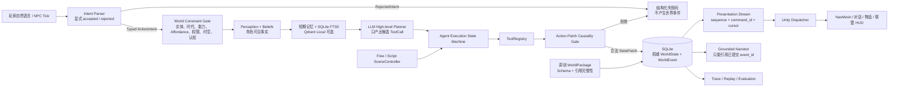
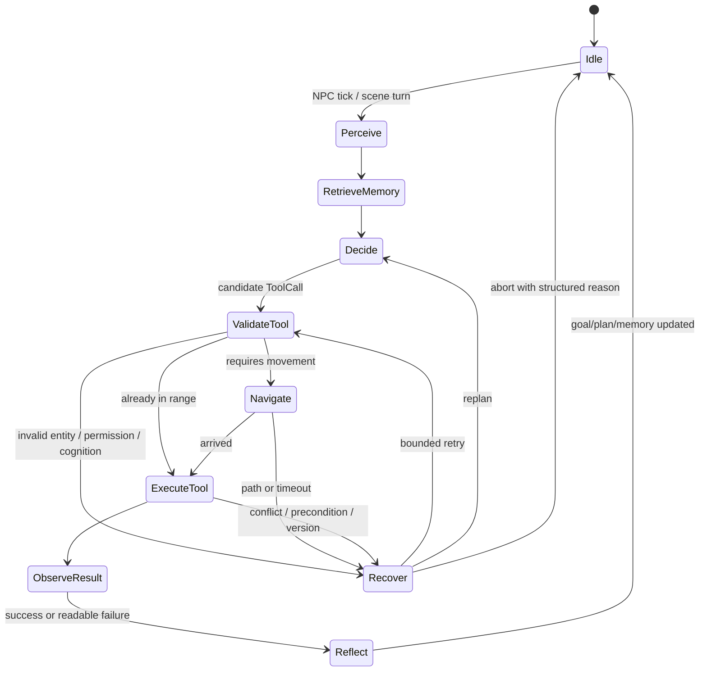
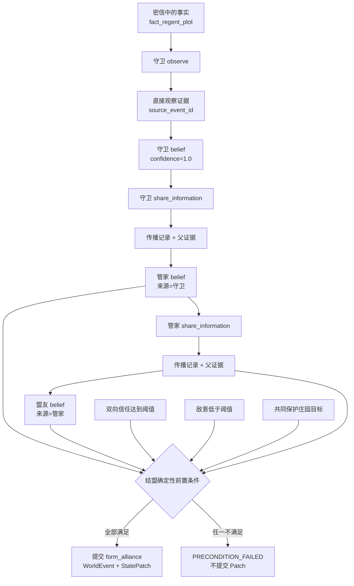
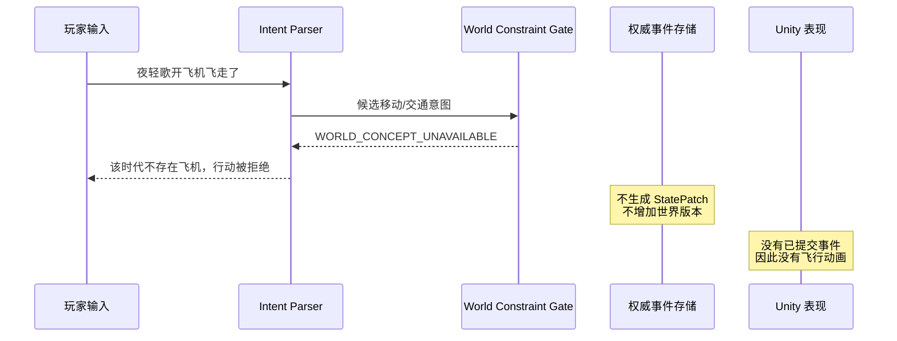

# NovelSim 作品集架构与因果图

这份文档只画当前仓库中已经实现并有测试覆盖的链路。核心边界是：
**LLM 提议意图，确定性运行时决定事实，Unity 只消费已提交事件做表现。**

## 1. 项目架构

关键代码对应：

| 责任 | 代码 |
|---|---|
| 自然语言意图与显式拒绝 | `engine/action_parser.py` |
| 世界规则、能力与可交互性门禁 | `engine/rules.py`、`engine/patch_validator.py` |
| ToolCall、工具权限和状态补丁 | `engine/agent_tools.py` |
| Agent 执行状态机与 Trace | `engine/agent_runtime.py`、`engine/agent_trace.py` |
| 场景调度与 Free/Script | `engine/scene_controller.py` |
| 信息传播、证据链与联盟 | `engine/information_propagation.py`、`engine/alliance_rules.py` |
| 事件持久化、回放和 Unity 命令流 | `engine/event.py`、`engine/presentation_stream.py` |
| 叙事事件依据审查 | `engine/narrative_consistency.py` |
| Unity 表现适配 | `unity/NovelSim3D/Assets/NovelSim/Scripts/World/ToolEventDispatcher.cs` |

## 2. Agent 状态机

LLM 只参与 `Decide` 和必要的 `Reflect`。导航、权限、工具执行、乐观锁、
`StatePatch` 校验、事件提交和恢复策略由代码执行。每次状态迁移都写入阶段化
Trace，因此失败可以归因到解析、实体、认知、规则、寻路、冲突或叙事依据。

## 3. 信息传播与联盟因果图

密信内容不会因为“NPC 在同一场景”自动进入所有角色认知。每次传播必须有
发送者已有 belief、目标角色、来源事件和父证据；联盟也不能由 LLM 口头宣布，
必须由共享目标、双向关系阈值和共同证据共同触发。

## 4. “夜轻歌开飞机飞走”为什么不会成为事实

这条边界不是靠“提示词里写不要开飞机”实现。古代世界把现代交通概念注册为
不可用，执行前由规则门禁拒绝；即使模型生成了越权 Patch，因果授权校验仍会拦截；
叙事层最后还必须引用已提交事件，因此不能把失败意图写成成功事实。

## 5. 可验证证据

| 问题 | 固定证据 |
|---|---|
| 世界门禁是否真的阻止违规 | G0/G1/G2/G3 放过违规数为 6/4/1/0 |
| 未知实体或非法 Patch 是否进入权威状态 | 9 案例评测中均为 0 |
| 信息传播是否可回放 | 传播准确率、证据链完整率、回放一致率均为 100% |
| 真实模型是否跑通 | 20/20 完整运行，18/20 目标成功 |
| 叙事是否有事件依据 | 14 个已提交事件的结构化依据率为 100% |
| 简单 Prompt 是否一定更差 | 否；强基线 Pairwise 为 3–3，优势只出现在冲突场景 |

数值来源及口径见
[`结构化场景评测.md`](结构化场景评测.md) 和
`evaluation/reports/`。6 题真人校准与 Judge 一致 `5/6`，一致率 `83.33%`、
Cohen's κ `0.667`；样本小且偏好主观，因此仍不把 3–3 外推为整体质量结论。
